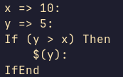
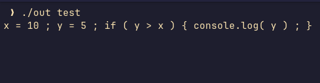

# Simple calculator language transpiler to JavaScript

Written in C, originally going to be transpiled to C, but I gave up on this halfway because of school stuff piling up.

The custom language is inspired by my calculator's BASIC language lol.

Still learnt a bit about Compilers/Transpilers though, just got no spare time to build that AST parser :(

Might remake, but this repo gonna be abandoned i think

## USAGE

```bash
make
./out test
```
Sample Program:


Output JS:

